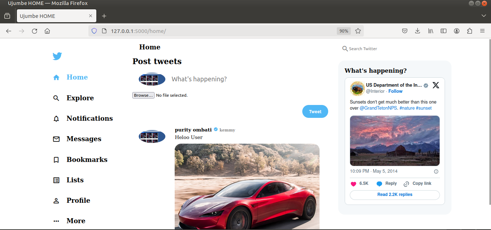

# Ujumbe Safi Hate Speech Detection
# Ujumbe Model 
This is a model that is used to predict the sentiment of a given text.
## Project Structure
### Backend Folder
This folder holds the backend code for the application.
Hosts the model and the API.

### Frontend Folder
This folder holds the frontend code for the application.

Hosts the UI.
### Dataset Folder
This folder holds the dataset used for the application and Trainig the model
### Notebooks
This folder holds the notebooks used for the application. Contains code used to trained the model.
Kindly test the notebooks with google coolab
### However all these are intergrated inside backend folder hence touch backend folder with caution.
## Installation
1. git clone https://github.com/Neivanny1/Ujumbe_safi_hate_speech_DS.git
2. cd Ujumbe_safi_hate_speech_DS
3. python3 -m venv env
4. source env/bin/activate
5. cd backend
6. pip install -r requirements.txt
7. python3 app.py
8. Go to web browser and type localhost:5000

## DEMO
### Login

### Register

### Home

